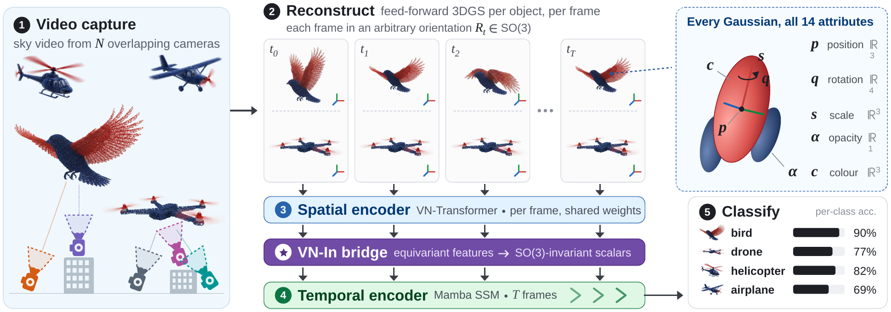

<div align="center">

# MambaSplat-4D: Rotation-Invariant 4D Classification of Gaussian Splatting Sequences

Alessandro Verdiesen · H. Peter Hofstee · Zaid Al-Ars

Delft University of Technology · **ACCV 2026**

<a href="https://github.com/lumiad-bv/MambaSplat-4D/raw/main/ACCV/MambaSplat_4D.pdf"></a>
<!-- <a href="https://arxiv.org/abs/TODO-LINK"></a> -->
<a href="https://lumiad-bv.github.io/MambaSplat-4D/"></a>
<a href="https://huggingface.co/datasets/alessandrolumiad/AeroSplat-4D"></a>
<a href="https://huggingface.co/alessandrolumiad/MambaSplat-4D"></a>

</div>



(1) Multi-camera video, (2) reconstructed per frame into 3D Gaussians (14 attributes each, arbitrary
rotation per frame), (3) VN-Transformer encodes each frame, ★ VN-In bridge makes features
rotation-invariant, (4) Mamba runs over the T frames, (5) class.

This work presents **MambaSplat-4D**, a model that classifies sequences of 3D Gaussian Splats
(bird, drone, airplane, helicopter) with predictions that are rotation-invariant by construction,
even when every frame is rotated independently. 3D Gaussian Splatting represents an object as
thousands of small coloured 3D ellipsoids; Vector Neurons are network layers whose features rotate
together with the input; Mamba is a state-space sequence model whose cost grows linearly with the
number of frames.

- **Gaussian Lifting**: maps all 14 Gaussian parameters (position, quaternion, scale, opacity, DC
  color) into an equivariant feature space, where a Vector Neuron transformer relates the Gaussians.
- **VN-In bridge**: a learned equivariant-frame projection that turns these features into
  rotation-invariant scalars, recovering up to the 3C-3 independent SO(3) invariants. On temporal
  4D benchmarks it reaches VNStdFeature's accuracy with 75x fewer bridge parameters.
- **AeroSplat-4D**: a synthetic dataset of temporal 4DGS sequences of aerial objects, released with
  its generation pipeline, the architecture, weights and evaluations.

## Install

```bash
git clone https://github.com/lumiad-bv/MambaSplat-4D.git && cd MambaSplat-4D
conda env create -f environment.yml && conda activate mambasplat
pip install -e .

# Mamba CUDA kernels, built against the torch above, in this order
export CUDA_HOME=$CONDA_PREFIX
pip install --no-build-isolation git+https://github.com/Dao-AILab/causal-conv1d@v1.6.0
pip install --no-build-isolation git+https://github.com/state-spaces/mamba@v2.3.0

cp .env.example .env   # set AEROSPLAT_DATA_ROOT, then: set -a; . ./.env; set +a
```

If your shell exports `LD_LIBRARY_PATH` to a system CUDA, `unset LD_LIBRARY_PATH` first, or torch
fails with `CUBLAS_STATUS_NOT_INITIALIZED`.

## Data

Download [AeroSplat-4D](https://huggingface.co/datasets/alessandrolumiad/AeroSplat-4D) into
`dataset/` (the default `AEROSPLAT_DATA_ROOT`). Training and evaluation need only the preprocessed
frames and rotation caches (1.8 GB); drop the `--include` flags to also get the raw `.ply` (30 GB):

```bash
pip install -U huggingface_hub
hf download alessandrolumiad/AeroSplat-4D --repo-type dataset --local-dir dataset \
    --include "preprocessed_50-25-25_4class/*" --include "rotation_cache/*"
```

`val` selects checkpoints, `test` is held out. To render and reconstruct your own assets, see
[pipelines/README.md](pipelines/README.md). To rebuild the `.pt` files from the shipped `.ply`
(same frames, different sampled Gaussians):

```bash
python -m mambasplat4d.preprocessing.preprocess_aerosplat4d --input $AEROSPLAT_DATA_ROOT/lgm_ply \
    --output $AEROSPLAT_DATA_ROOT/preprocessed_full --split-yaml assets/splits/open_split.yaml \
    --n-versions 1 --seed 42 --sample-points-num 8192 --fps-point-all 1200 --num-points 1024
python -m mambasplat4d.preprocessing.subsets.build_lgm_4class --src $AEROSPLAT_DATA_ROOT/preprocessed_full \
    --dst $AEROSPLAT_DATA_ROOT/preprocessed_regenerated --split-yaml assets/splits/open_split.yaml
```

## Weights

```bash
HF=https://huggingface.co/alessandrolumiad/MambaSplat-4D/resolve/main
for f in mambasplat_X_z.pt mambasplat_C_z.pt open/mambasplat_X_z.pt open/mambasplat_C_z.pt; do
  mkdir -p models/$(dirname $f) && wget -O models/$f $HF/$f
done
```

[MambaSplat-4D on Hugging Face](https://huggingface.co/alessandrolumiad/MambaSplat-4D) holds one
z-trained checkpoint per variant, the best seed of each run (the paper reports the seed mean):

- `mambasplat_{X,C}_z.pt`: main-paper Tab. 1, trained on all 91 assets.
- `open/mambasplat_{X,C}_z.pt`: supplementary Tab. 1, trained on the released 52 assets.

`X` uses all 14 Gaussian coefficients, `C` centres only (`dataset.feature_mode=C`). Score the
released test split with the `open/` checkpoints only: 5 of its 13 test assets are in the training
split of the 91-asset models.

## Inference

Classify one sequence (a directory of `frame_XXXX.ply`):

```bash
python -m mambasplat4d.cli.predict experiment=aerosplat4d_tab1 \
    +checkpoint=models/mambasplat_X_z.pt +input=/path/to/sequence_dir
```

Evaluate under the paper's four rotation protocols (the rotation cache is generated on first use):

```bash
python -m mambasplat4d.cli.eval_rotation experiment=aerosplat4d_tab1 rotation.train=z seed=1 \
    +checkpoint=models/open/mambasplat_X_z.pt rotation_eval.splits=[test]
```

## Training

```bash
python -m mambasplat4d.cli.train experiment=aerosplat4d rotation.train=so3 seed=42
python -m mambasplat4d.cli.train experiment=aerosplat4d rotation.train=z dataset.feature_mode=C
```

About 6 GB GPU memory and 20 min per run on an RTX 5090. Keep `hardware.compile=true`. Outputs go
to `$AEROSPLAT_RESULTS_ROOT/<run_name>/train_<mode>/seed_<seed>/`. Architecture configs:
`configs/spatial/vn_3dgs.yaml`, `configs/temporal/vn_mamba.yaml`.

### Reproduce supplementary Tab. 1

```bash
python -m mambasplat4d.cli.train -m experiment=aerosplat4d_tab1
for f in C X; do for r in z so3; do for s in 1 2 3 4 5; do
  python -m mambasplat4d.cli.eval_rotation experiment=aerosplat4d_tab1 \
      dataset.feature_mode=$f rotation.train=$r seed=$s \
      +checkpoint=$AEROSPLAT_RESULTS_ROOT/mambasplat_$f/train_$r/seed_$s/best_model.pt
done; done; done
python -m mambasplat4d.cli.aggregate
```

The dataset's `rotation_cache/` holds the original rotation caches this table was scored on (test
split, seeds 1-5, T=16, 3 trials). They are read from `dataset/rotation_cache/` by default.

### Latency

```bash
python -m mambasplat4d.cli.latency experiment=aerosplat4d +lgm_json=lgm_latency.json
```

`lgm_latency.json` is optional, from `pipelines/lgm/batch_reconstruct.py --profile --profile-json`.

## Licence

Code MIT, weights CC BY-NC 4.0, dataset per asset (see [ATTRIBUTION.md](https://huggingface.co/datasets/alessandrolumiad/AeroSplat-4D/blob/main/ATTRIBUTION.md) on the dataset page).

## Acknowledgements

- [LGM](https://github.com/3DTopia/LGM), 
- [Mamba](https://github.com/state-spaces/mamba),
- [VN-Transformer](https://github.com/lucidrains/VN-transformer),
- [Vector Neurons](https://github.com/FlyingGiraffe/vnn),
- [P4Transformer](https://github.com/hehefan/P4Transformer),
- [Mamba4D](https://github.com/IRMVLab/Mamba4D),
- [NVIDIA Isaac Sim](https://developer.nvidia.com/isaac/sim).

## Citation

```bibtex
@inproceedings{verdiesen2026mambasplat4d,
  title     = {{MambaSplat-4D}: Rotation-Invariant {4D} Classification of {Gaussian} Splatting Sequences},
  author    = {Verdiesen, Alessandro and Hofstee, H. Peter and Al-Ars, Zaid},
  booktitle = {Asian Conference on Computer Vision (ACCV)},
  year      = {2026}
}
```
